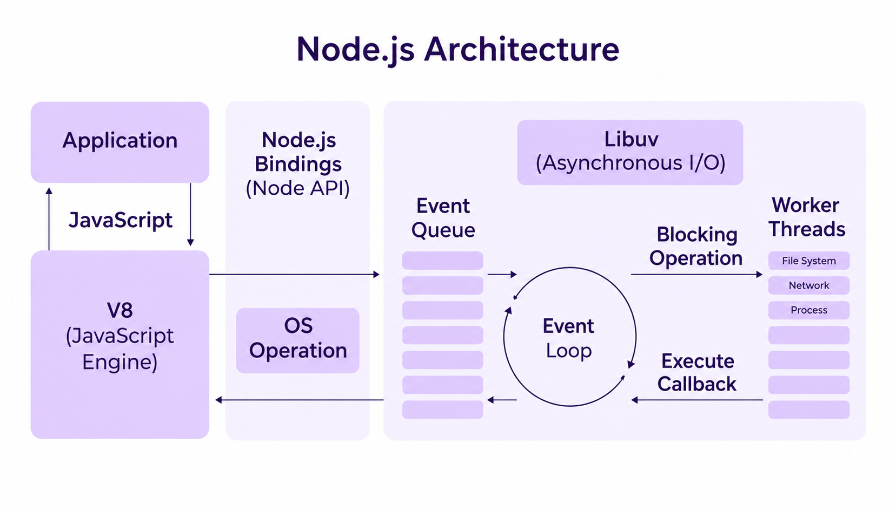
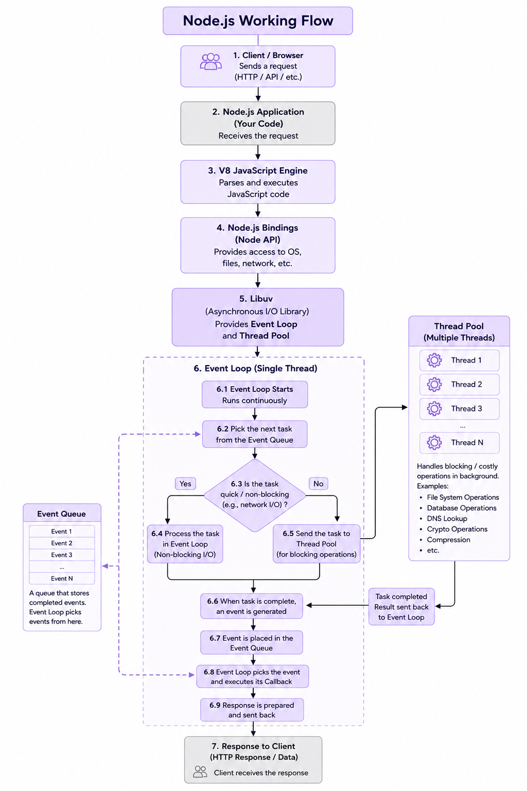

## Architecture of Node.js

### Working of Node.js

JavaScript code can be executed in the browser because browsers have JavaScript engines. To run JavaScript code outside the browser, a runtime environment is needed, such as **Node.js**.

Node.js runs the **V8 JavaScript engine**, the JavaScript engine used by Google Chrome, outside the browser. Node.js receives requests from clients and sends responses back. It uses a **single main thread** to execute JavaScript code.

Node.js can handle many requests at the same time because it uses:

- Asynchronous programming
- Non-blocking I/O
- Event Loop
- Thread Pool
- Libuv

### 1. Application

- This is the program written by the developer.It contains the JavaScript code that handles client requests. **Example:** A user clicks on **"Login"**, and the browser sends a login request to the Node.js server.

### 2. V8 JavaScript Engine

- V8 is the JavaScript engine used by Node.js to execute JavaScript code.It converts JavaScript code into machine-level instructions.

### 3. Node.js Bindings (Node API)

- Bindings act as a bridge between JavaScript and Node.js. They allow JavaScript to access things like the file system, network, and OS. **Example:** `fs.readFile()` uses Node.js APIs to work with files.

### 4. OS Operations

- OS means **Operating System**, such as Windows or Linux. Node.js can use the OS to perform operations like reading files or accessing the network.The OS performs these low-level tasks and provides the result back to Node.js.

### 5. Libuv

- Libuv is a library used by Node.js for asynchronous I/O operations. It is written mainly in **C**. It provides the **Event Loop** and **Thread Pool** and helps Node.js perform operations without blocking the main JavaScript thread.

Libuv mainly provides:

- **Event Loop**
- **Thread Pool**

### 6. Event Queue

- All the callbacks/tasks that need to be processed are pushed into event queue. Asynchronous functions put their callbacks into this queue. The Event Loop's job is to continuously monitor this queue.

### 7. Event Loop

- The Event Loop is the main mechanism that keeps Node.js running. It continuously checks for ready tasks present in event queue and executes their callbacks. It allows Node.js to handle many requests without creating a separate JavaScript thread for every request.

### 8. Types of Operations

There are two main types of operations:

### 1. Non-blocking I/O : 
Non-blocking I/O means Node.js does not wait for an I/O operation to finish before continuing with other JavaScript work.

### 2. Blocking I/O : 
A blocking operation is an operation that prevents the main JavaScript thread from continuing until the operation finishes. If it is executed on the main thread, it can temporarily stop other JavaScript work. Blocking operations can be handled using the libuv thread pool so that the main thread remains available.

### 9. Thread Pool

The libuv thread pool is used to handle blocking operations.
It can handle tasks such as:

- Certain file-system operations
- Some DNS operations
- Cryptographic operations
- Compression

When the task is finished, the result is made available to the Event Loop so its callback can execute. By default, the libuv thread pool has **4 worker threads**. This size can be changed tho.

### 10.  Callback

A callback is a function that runs after an asynchronous operation finishes.**Example:** After reading a file, the callback receives the result or error.The callback is eventually executed by the Event Loop.

